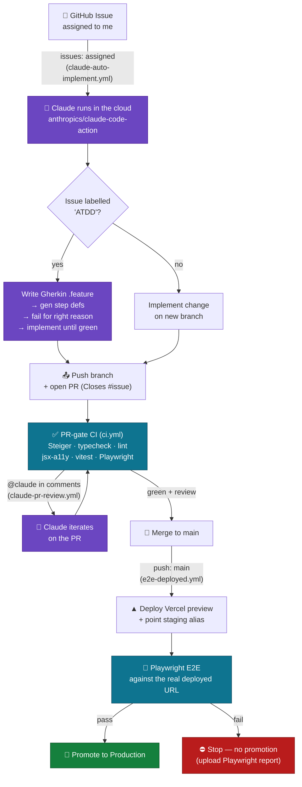

# End-to-End Flow: Issue → Claude → PR → CI → E2E → Production

## Reading the diagram

- **Kickoff is an assignment, not a keystroke.** Assigning the issue is the entire trigger — Claude runs in CI and hands back a PR.
- **ATDD is enforced by the pipeline**, not by hoping the author remembers it — the `ATDD` label routes work through test-first steps.
- **Two test gates, two purposes:** PR-gate CI (fast: static checks + unit + Playwright on the branch) vs. post-merge E2E against a **real deployed URL**.
- **Production is earned:** promotion only happens if end-to-end tests pass against the live preview.
